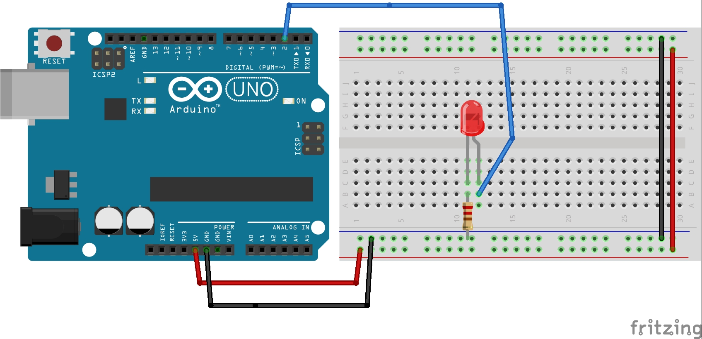
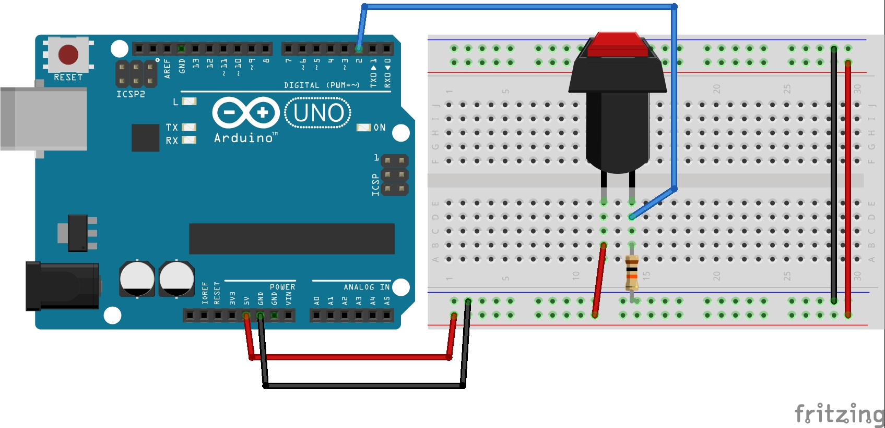
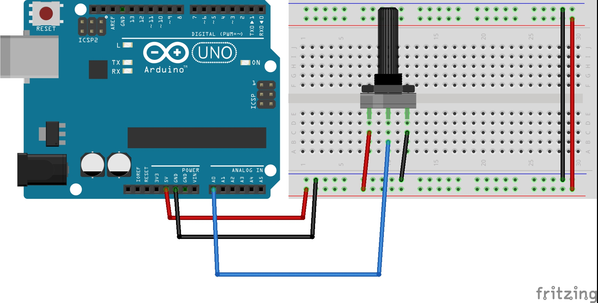
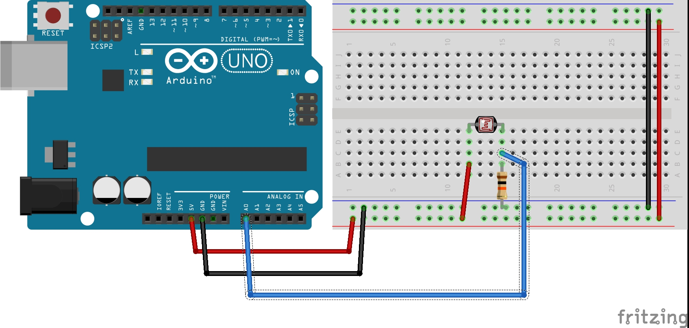

# Analog

Start with wire 2 LEDs with one switch

## Potentiometer

A potentiometer is a variable resistor. Potentiometers can be linear like a slider or rotary like a volume knob.

[Basic AnalogRead](../BreadboardExamples/analogRead.ino)

AnalogWrite- [Understanding PWM](https://www.arduino.cc/en/Tutorial/PWM)

[Basic AnalogRead/AnalogWrite](../BreadboardExamples/analogReadInOut.ino)

## 2 Wire Variable Resistors

Some variable resistors have 2 wires, generally without polarity. One power goes to power, the other goes with a 10k resistor to ground. In the same rail as the variable resistor and 10k, we add a reference wire that goes to the analog read pins.

#### Types of 2 Wire Variable Resistors

* Photocell
* Thermistor

[Mapping Values](https://github.com/zevenrodriguez/CIM542-642/blob/master/arduino/map/map.ino)

#### Connecting a piezo
To connect the piezo or speaker connect one side to your digital pin and the other to ground. Use a 220ohm resistor to ground.

[Tone Map](https://github.com/zevenrodriguez/CIM542-642/blob/master/arduino/toneMap/toneMap.ino)
